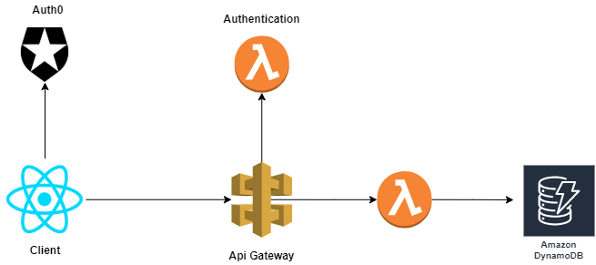

# ToDoList

You can see this app in the next url: https://to-do-list-sluis117.vercel.app/

### What technologies I used?

- Serverless Framework https://www.serverless.com/
- NodeJs
- TypeScript
- ReactJs + Redux
- DynamoDb
- Aws (ApiGateway, lambda Functions)
- Auth0 https://auth0.com/
- Vercel https://vercel.com/
- Sass

### Architecture

## What I learned?

- Hands-on experience with Amazon Web Services
- Becoming familiar with Serverless Framework
- Data Persistence (DynamoDB)
- User Authentication with Auth0

## Authors

- **Luis Sic** - [Linkedin](https://www.linkedin.com/in/luis-antonio-antonio-sic-868181116/)

## License

This project is licensed under the MIT License - see the [LICENSE.md](LICENSE.md) file for details
